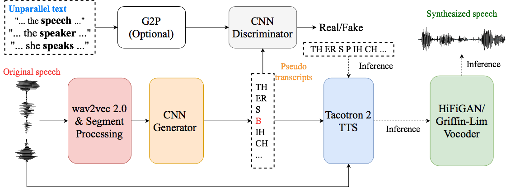

<div align="left"></div>

## Unsupervised Text-to-Speech Synthesis by Unsupervised Automatic-Speech-Recognition

UnsupTTS is an unsupervised text-to-speech (TTS) system learned from unparallel speech and text data

If you find this project useful, please consider citing our paper.
```
@inproceedings{Ni-etal-2022-unsup-tts,
  author={Junrui Ni, Liming Wang, Heting Gao, Kaizhi Qian, Yang Zhang, Shiyu Chang, Mark Hasegawa-Johnson},
  title={Unsupervised text-to-speech synthesis by unsupervised automatic speech recognition},
  booktitle={arKiv},
  year={2022},
  url={https://arxiv.org/pdf/2203.15796.pdf}
}
```

### Speech Demo
Speech samples can be found [here](https://cactuswiththoughts.github.io/UnsupTTS-Demo/)

### Dependencies
- [fairseq](https://github.com/pytorch/fairseq) >= 1.0.0 with dependencies for [wav2vec-u](https://github.com/pytorch/fairseq/tree/main/examples/wav2vec/unsupervised)
- [ESPnet](https://github.com/espnet/espnet) <= 010f483e7661019761b169563ee622464125e56f
- [LanguageNet G2Ps](https://github.com/uiuc-sst/g2ps)

### Pretrained models
| LJSpeech | ASR | TTS |
|--|--|--|
| en |[link]|[link]|

| CSS10 | Unit | ASR | TTS |
|--|--|--|
| ja | char |[link]|[link]|
| hu | char |[link]|[link]|
| nl | char |[link]|[link]|
| fi | char |[link]|[link]|
| es | char |[link]|[link]|
| de | char |[link]|[link]|
| hu | phn |[link]|[link]|
| nl | phn |[link]|[link]|
| fi | phn |[link]|[link]|
